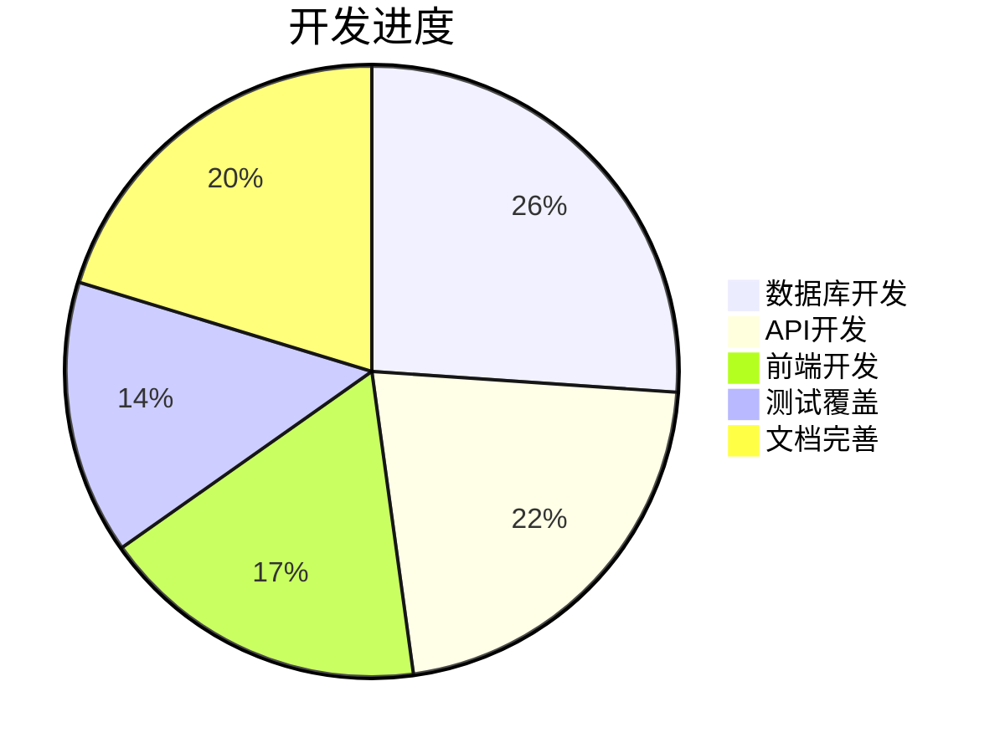

# 项目开发状态检查报告 📊

## 目录
- [1. 数据库结构完整性](#1-数据库结构完整性-)
- [2. 数据映射关系](#2-数据映射关系-)
- [3. 关联关系测试](#3-关联关系测试-)
- [4. 待处理事项](#4-待处理事项-)
- [5. 开发进度评估](#5-开发进度评估-)
- [6. 下一步计划](#6-下一步计划-)
- [7. 风险评估](#7-风险评估-)

## 1. 数据库结构完整性 ✅

所有核心模块的数据库表结构已完成：

- [x] 用户认证与画像模块
- [x] 资产管理模块
- [x] 交易记录模块
- [x] 预算管理模块
- [x] 目标管理模块
- [x] 通知系统模块
- [x] 系统配置模块

## 2. 数据映射关系 ✅

前后端数据映射完整性验证：

| 模块 | 状态 | 测试结果 |
|-----|------|---------|
| 用户数据映射 | ✅ 完成 | 通过 |
| 资产数据映射 | ✅ 完成 | 通过 |
| 交易数据映射 | ✅ 完成 | 通过 |
| 预算数据映射 | ✅ 完成 | 通过 |
| 目标数据映射 | ✅ 完成 | 通过 |
| 通知数据映射 | ✅ 完成 | 通过 |

## 3. 关联关系测试 ✅

数据库关联关系测试结果：

- **用户-预算-交易关联**
  - 创建测试用户 ✅
  - 创建预算记录 ✅
  - 创建交易记录 ✅
  
- **资产-投资-分析关联**
  - 资产组件创建 ✅
  - 投资收益记录 ✅
  - AI分析记录 ✅
  
- **用户偏好-通知-AI对话关联**
  - 用户偏好设置 ✅
  - 通知系统集成 ✅
  - AI对话记录 ✅

## 4. 待处理事项 ⚠️

### 4.1 高优先级
1. [ ] 数据验证机制实现
2. [ ] 数据迁移脚本编写
3. [ ] 错误处理机制完善
4. [ ] 性能监控系统优化

### 4.2 中优先级
1. [ ] API文档更新
2. [ ] 单元测试补充
3. [ ] 智能建议功能实现
4. [ ] 预警机制优化

### 4.3 低优先级
1. [ ] 数据分析报告功能
2. [ ] 用户行为跟踪
3. [ ] 性能基准测试
4. [ ] 文档自动更新机制

## 5. 开发进度评估 📈

## 6. 下一步计划 🎯

1. **完成高优先级待处理事项**
   - 实现数据验证机制
   - 编写数据迁移脚本
   - 完善错误处理

2. **进行全面的系统测试**
   - 单元测试
   - 集成测试
   - 性能测试

3. **优化性能和用户体验**
   - 优化查询性能
   - 改善用户界面
   - 提升响应速度

4. **完善文档和测试用例**
   - 更新API文档
   - 补充测试用例
   - 完善使用说明

5. **准备部署和发布计划**
   - 制定部署策略
   - 准备回滚方案
   - 规划发布时间

## 7. 风险评估 ⚠️

### 数据一致性风险
- **风险等级**: 高
- **解决方案**: 
  - 实现数据验证机制
  - 添加数据同步机制
  - 定期数据一致性检查

### 性能风险
- **风险等级**: 中
- **解决方案**:
  - 优化数据库查询
  - 实现缓存策略
  - 添加性能监控

### 安全风险
- **风险等级**: 高
- **解决方案**:
  - 加强安全审计
  - 完善权限控制
  - 定期安全评估

### 可扩展性风险
- **风险等级**: 中
- **解决方案**:
  - 优化架构设计
  - 提高模块化程度
  - 预留扩展接口

---

> **注意**: 需要团队重点关注高优先级待处理事项，确保核心功能的稳定性和可靠性。 