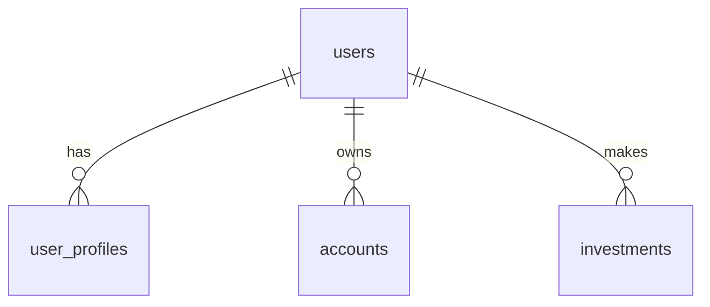
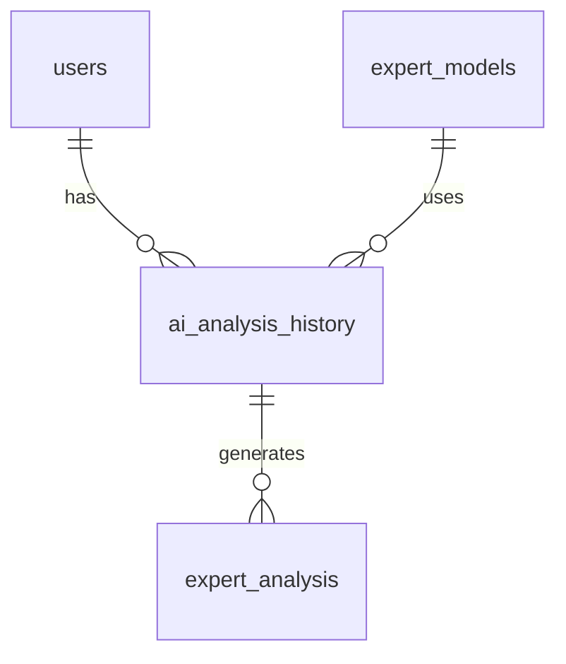
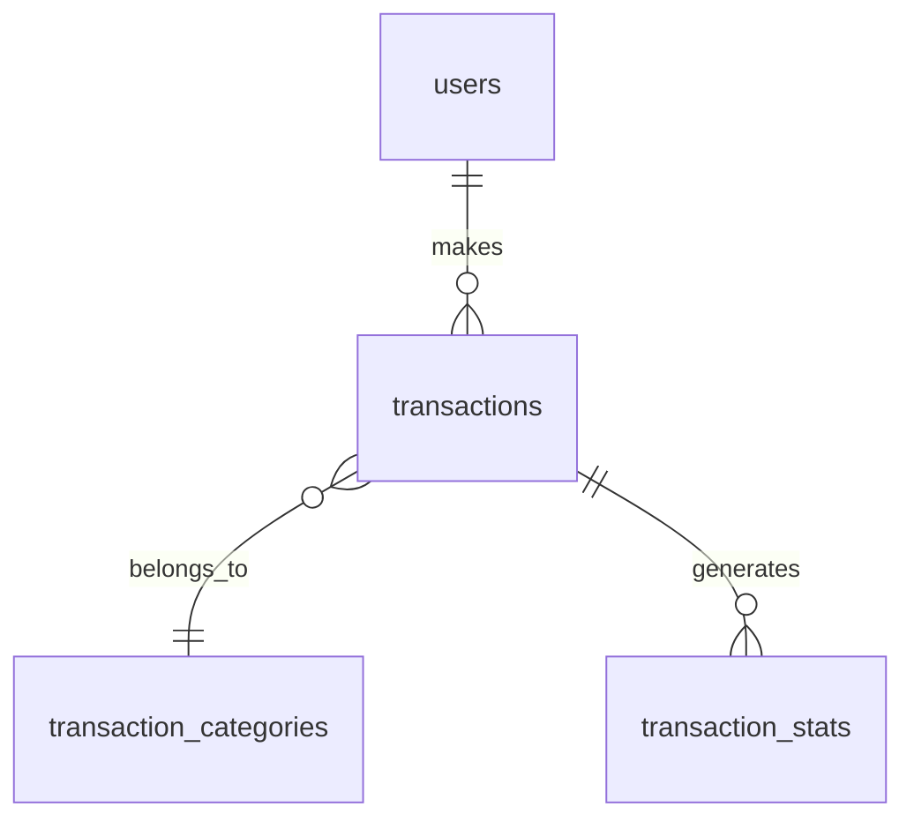
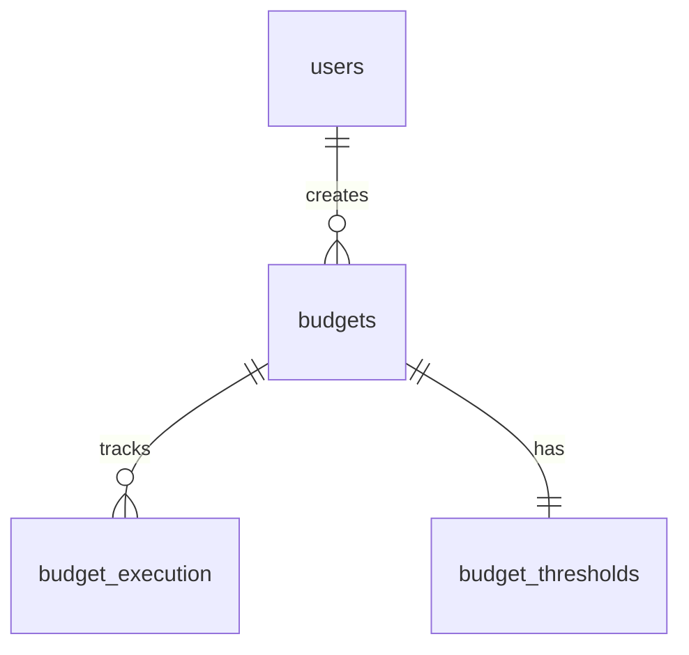
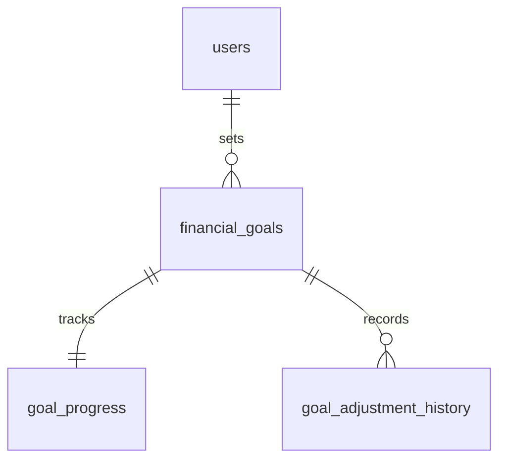
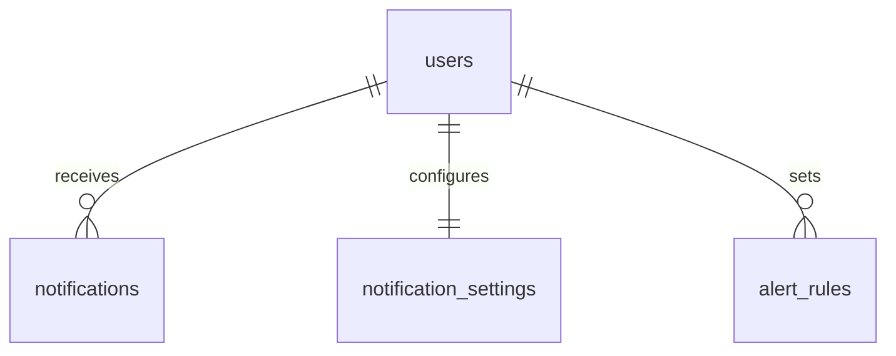
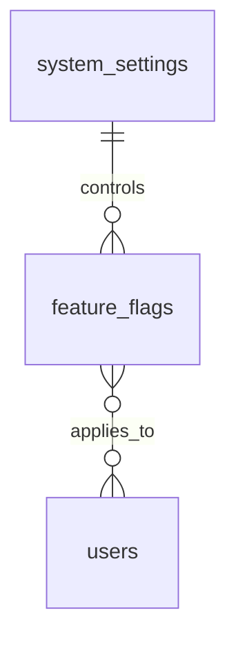

# 数据库设计文档 - 测试状态更新 ✅

## 已完成测试的表结构

### 1. 核心表
✅ users
✅ user_profiles
✅ accounts
✅ wealth_components
✅ wealth_snapshots

### 2. 投资相关表
✅ investments
✅ investment_records
❌ asset_estimations (待测试)
❌ asset_calibrations (待测试)

### 3. AI分析相关表
✅ ai_analysis_history
✅ expert_models
✅ expert_analysis
✅ ai_chat_sessions
✅ ai_chat_history

### 4. 交易相关表
✅ transactions
✅ transaction_stats
✅ transaction_categories
✅ payment_methods

### 5. 预算相关表
✅ budgets
✅ budget_execution
✅ budget_categories
✅ budget_thresholds

### 6. 目标管理表
✅ financial_goals
✅ goal_progress
✅ goal_adjustment_history
✅ goal_recommendations

### 7. 通知系统表
✅ notifications
✅ notification_settings
✅ notification_history
✅ alert_rules

### 8. 系统配置表
✅ system_settings
✅ feature_flags
✅ api_keys
✅ integration_configs

[继续其他模块...]

## 详细表结构设计

### 1. 核心表结构

#### users 表
| 字段名 | 类型 | 说明 | 索引 |
|--------|------|------|------|
| id | SERIAL | 主键 | ✅ PRIMARY |
| username | VARCHAR(50) | 用户名 | ✅ UNIQUE |
| email | VARCHAR(100) | 邮箱 | ✅ UNIQUE |
| password_hash | VARCHAR(255) | 密码哈希 | - |
| created_at | TIMESTAMP | 创建时间 | ✅ INDEX |
| updated_at | TIMESTAMP | 更新时间 | - |

#### user_profiles 表
| 字段名 | 类型 | 说明 | 索引 |
|--------|------|------|------|
| id | SERIAL | 主键 | ✅ PRIMARY |
| user_id | INTEGER | 用户ID | ✅ FOREIGN, UNIQUE |
| age_group | VARCHAR(20) | 年龄段 | ✅ INDEX |
| gender | gender | 性别(male/female) | ✅ INDEX |
| life_stage | life_stage | 人生阶段 | ✅ INDEX |
| financial_status | VARCHAR(50) | 财务状况 | - |
| housing_status | VARCHAR(50) | 住房状况 | - |
| employment_status | VARCHAR(50) | 就业状况 | - |
| lifestyle | VARCHAR(50) | 生活方式 | - |
| short_term_goal | VARCHAR(50) | 短期目标 | - |
| mid_term_goal | VARCHAR(50) | 中期目标 | - |
| long_term_goal | VARCHAR(50) | 长期目标 | - |
| additional_info | JSONB | 扩展信息 | - |
| created_at | TIMESTAMP | 创建时间 | - |
| updated_at | TIMESTAMP | 更新时间 | - |

### 2. 枚举类型

#### gender 枚举
| 值 | 说明 |
|--------|------|
| male | 男性 |
| female | 女性 |

#### life_stage 枚举
| 值 | 说明 |
|--------|------|
| student | 学生 |
| fresh_graduate | 应届毕业生 |
| career_start | 职业起步 |
| career_growth | 职业发展 |
| single | 单身 |
| relationship | 恋爱中 |
| married | 已婚 |
| parent | 为人父母 |
| midlife | 中年 |
| retirement | 退休 |

### 3. 触发器
| 名称 | 表 | 说明 |
|--------|------|------|
| update_user_profiles_updated_at | user_profiles | 自动更新 updated_at 字段 |

### 2. 投资相关表结构

#### investments 表
| 字段名 | 类型 | 说明 | 索引 |
|--------|------|------|------|
| id | SERIAL | 主键 | ✅ PRIMARY |
| user_id | INTEGER | 用户ID | ✅ FOREIGN |
| type | VARCHAR(50) | 投资类型 | ✅ INDEX |
| amount | DECIMAL(15,2) | 投资金额 | - |
| status | VARCHAR(20) | 投资状态 | ✅ INDEX |

### 3. AI分析相关表结构

#### ai_analysis_history 表
| 字段名 | 类型 | 说明 | 索引 |
|--------|------|------|------|
| id | SERIAL | 主键 | ✅ PRIMARY |
| user_id | INTEGER | 用户ID | ✅ FOREIGN |
| analysis_type | VARCHAR(50) | 分析类型 | ✅ INDEX |
| analysis_result | JSONB | 分析结果 | - |
| confidence_score | DECIMAL(5,2) | 置信度 | ✅ INDEX |
| created_at | TIMESTAMP | 创建时间 | ✅ INDEX |

#### expert_models 表
| 字段名 | 类型 | 说明 | 索引 |
|--------|------|------|------|
| id | SERIAL | 主键 | ✅ PRIMARY |
| model_type | VARCHAR(50) | 模型类型 | ✅ INDEX |
| parameters | JSONB | 模型参数 | - |
| version | VARCHAR(20) | 版本号 | ✅ INDEX |
| status | VARCHAR(20) | 状态 | ✅ INDEX |

### 4. 交易相关表结构

#### transactions 表
| 字段名 | 类型 | 说明 | 索引 |
|--------|------|------|------|
| id | SERIAL | 主键 | ✅ PRIMARY |
| user_id | INTEGER | 用户ID | ✅ FOREIGN |
| amount | DECIMAL(15,2) | 交易金额 | - |
| type | VARCHAR(20) | 交易类型 | ✅ INDEX |
| category_id | INTEGER | 分类ID | ✅ FOREIGN |
| created_at | TIMESTAMP | 交易时间 | ✅ INDEX |

#### transaction_stats 表
| 字段名 | 类型 | 说明 | 索引 |
|--------|------|------|------|
| id | SERIAL | 主键 | ✅ PRIMARY |
| user_id | INTEGER | 用户ID | ✅ FOREIGN |
| period | VARCHAR(7) | 统计周期 | ✅ INDEX |
| stats_data | JSONB | 统计数据 | - |
| updated_at | TIMESTAMP | 更新时间 | ✅ INDEX |

### 5. 预算管理相关表结构

#### budgets 表
| 字段名 | 类型 | 说明 | 索引 |
|--------|------|------|------|
| id | SERIAL | 主键 | ✅ PRIMARY |
| user_id | INTEGER | 用户ID | ✅ FOREIGN |
| category_id | INTEGER | 预算类别ID | ✅ FOREIGN |
| amount | DECIMAL(15,2) | 预算金额 | - |
| period | VARCHAR(7) | 预算周期 | ✅ INDEX |
| created_at | TIMESTAMP | 创建时间 | ✅ INDEX |

#### budget_execution 表
| 字段名 | 类型 | 说明 | 索引 |
|--------|------|------|------|
| id | SERIAL | 主键 | ✅ PRIMARY |
| budget_id | INTEGER | 预算ID | ✅ FOREIGN |
| spent_amount | DECIMAL(15,2) | 已用金额 | - |
| remaining_amount | DECIMAL(15,2) | 剩余金额 | - |
| status | VARCHAR(20) | 执行状态 | ✅ INDEX |
| last_updated | TIMESTAMP | 最后更新 | ✅ INDEX |

#### budget_thresholds 表
| 字段名 | 类型 | 说明 | 索引 |
|--------|------|------|------|
| id | SERIAL | 主键 | ✅ PRIMARY |
| budget_id | INTEGER | 预算ID | ✅ FOREIGN |
| warning_threshold | DECIMAL(5,2) | 警告阈值 | - |
| critical_threshold | DECIMAL(5,2) | 严重阈值 | - |
| notification_enabled | BOOLEAN | 通知开关 | - |

### 6. 目标管理相关表结构

#### financial_goals 表
| 字段名 | 类型 | 说明 | 索引 |
|--------|------|------|------|
| id | SERIAL | 主键 | ✅ PRIMARY |
| user_id | INTEGER | 用户ID | ✅ FOREIGN |
| goal_type | VARCHAR(50) | 目标类型 | ✅ INDEX |
| target_amount | DECIMAL(15,2) | 目标金额 | - |
| deadline | DATE | 截止日期 | ✅ INDEX |
| status | VARCHAR(20) | 目标状态 | ✅ INDEX |

#### goal_progress 表
| 字段名 | 类型 | 说明 | 索引 |
|--------|------|------|------|
| id | SERIAL | 主键 | ✅ PRIMARY |
| goal_id | INTEGER | 目标ID | ✅ FOREIGN |
| current_amount | DECIMAL(15,2) | 当前金额 | - |
| completion_rate | DECIMAL(5,2) | 完成率 | ✅ INDEX |
| last_updated | TIMESTAMP | 最后更新 | ✅ INDEX |

### 7. 通知系统相关表结构

#### notifications 表
| 字段名 | 类型 | 说明 | 索引 |
|--------|------|------|------|
| id | SERIAL | 主键 | ✅ PRIMARY |
| user_id | INTEGER | 用户ID | ✅ FOREIGN |
| type | VARCHAR(50) | 通知类型 | ✅ INDEX |
| content | TEXT | 通知内容 | - |
| status | VARCHAR(20) | 通知状态 | ✅ INDEX |
| created_at | TIMESTAMP | 创建时间 | ✅ INDEX |

#### notification_settings 表
| 字段名 | 类型 | 说明 | 索引 |
|--------|------|------|------|
| id | SERIAL | 主键 | ✅ PRIMARY |
| user_id | INTEGER | 用户ID | ✅ FOREIGN |
| notification_type | VARCHAR(50) | 通知类型 | ✅ INDEX |
| channels | JSONB | 通知渠道 | - |
| frequency | VARCHAR(20) | 通知频率 | ✅ INDEX |
| enabled | BOOLEAN | 是否启用 | - |

#### alert_rules 表
| 字段名 | 类型 | 说明 | 索引 |
|--------|------|------|------|
| id | SERIAL | 主键 | ✅ PRIMARY |
| user_id | INTEGER | 用户ID | ✅ FOREIGN |
| rule_type | VARCHAR(50) | 规则类型 | ✅ INDEX |
| conditions | JSONB | 触发条件 | - |
| actions | JSONB | 执行动作 | - |
| priority | INTEGER | 优先级 | ✅ INDEX |

### 8. 系统配置相关表结构

#### system_settings 表
| 字段名 | 类型 | 说明 | 索引 |
|--------|------|------|------|
| id | SERIAL | 主键 | ✅ PRIMARY |
| setting_key | VARCHAR(100) | 配置键 | ✅ UNIQUE |
| setting_value | JSONB | 配置值 | - |
| description | TEXT | 配置说明 | - |
| updated_at | TIMESTAMP | 更新时间 | ✅ INDEX |

#### feature_flags 表
| 字段名 | 类型 | 说明 | 索引 |
|--------|------|------|------|
| id | SERIAL | 主键 | ✅ PRIMARY |
| feature_key | VARCHAR(100) | 功能键 | ✅ UNIQUE |
| status | BOOLEAN | 启用状态 | - |
| user_groups | JSONB | 用户组 | - |
| valid_until | TIMESTAMP | 有效期 | ✅ INDEX |

## 表关联关系

### 用户相关关联


### AI分析相关关联


### 交易相关关联


### 触发器设计

#### 账户余额更新触发器
```sql
CREATE TRIGGER update_account_balance
AFTER INSERT ON transactions
FOR EACH ROW
EXECUTE FUNCTION update_balance();
```

#### 交易统计更新触发器
```sql
CREATE TRIGGER update_transaction_stats
AFTER INSERT OR UPDATE ON transactions
FOR EACH ROW
EXECUTE FUNCTION update_stats();
```

#### AI分析历史记录触发器
```sql
CREATE TRIGGER log_ai_analysis
AFTER INSERT ON ai_analysis_history
FOR EACH ROW
EXECUTE FUNCTION notify_user_analysis();
```

### 预算管理关联


### 目标管理关联


### 通知系统关联


### 系统配置关联


## 索引优化策略

### 复合索引设计
```sql
-- 交易查询优化
CREATE INDEX idx_transactions_user_date ON transactions(user_id, created_at);

-- AI分析查询优化
CREATE INDEX idx_ai_analysis_user_type ON ai_analysis_history(user_id, analysis_type);
```

### 分区表设计
```sql
-- 通知历史分区
CREATE TABLE notifications_partition OF notifications
FOR VALUES FROM ('2024-01-01') TO ('2025-01-01')
PARTITION BY RANGE (created_at);

-- 交易记录分区
CREATE TABLE transactions_partition OF transactions
FOR VALUES FROM ('2024-01-01') TO ('2025-01-01')
PARTITION BY RANGE (created_at);
```

### 缓存策略
| 数据类型 | 缓存时间 | 更新策略 |
|---------|----------|----------|
| 用户配置 | 30分钟 | 被动失效 |
| 统计数据 | 5分钟 | 主动更新 |
| 系统设置 | 1小时 | 变更触发 |

